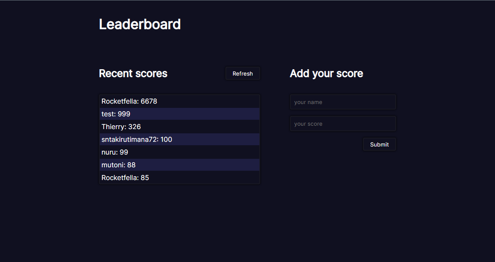

# Leaderboard

A _**Leaderboard**_ application displays user scores on the app layout board, and also allows user to add more scores to the board. The displayed scores are arranged in descending order.

<p>
  
</p>


## Built With

- html
- css
- JavaScript
- API
- Webpack


## Live Demo

For user first hand experience, please visit this <a href="https://sntakirutimana72.github.io/Leaderboard/" target="_blank" rel="noopener">link</a>


## Getting Started

To get a copy of this project running on your local computer, do the followings:

### Prerequisites

- Must have a working computer
- A Web-Browser installed (Chrome - Recommended)

### Setup

- Install _VSCode_ ([link](https://code.visualstudio.com/download))
- Clone this project repository on your local computer. ([link](https://github.com/sntakirutimana72/Leaderboard))
- Open the project directory with _VSCode_

### Install

Open _Terminal/Shell_ inside your _VSCode_ and run
  ```
    npm install --force
  ```

### Run tests

- For _webhint_ tests, run
  ```
    npm run lint:hint
  ```
- For _stylelint_ tests, run
  ```
    npm run lint:style
  ```
- For _eslint_ tests, run
  ```
    npm run lint:es
  ```
- For running a _**webpack local server**_, run
  ```
    npm start
  ```


## Authors

👤 **Steve**

- GitHub: [@sntakirutimana72](https://github.com/sntakirutimana72/)

## 🤝 Contributing

Contributions, issues, and feature requests are welcome!

Feel free to check the [issues page](https://github.com/sntakirutimana72/Leaderboard/issues/).

## Show your support

Give a ⭐️ if you like this project!

## Acknowledgments

- Fellow Micronauts
